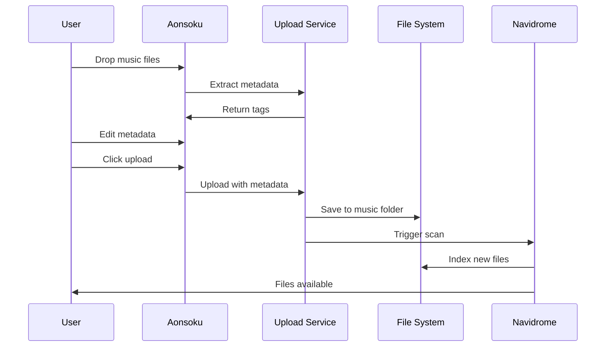

# 🎵 Aonsoku Music Upload Feature

## Overview

A complete music upload system for Aonsoku that allows users to upload music files directly to their Navidrome server with full metadata editing capabilities.

## ✨ Features

- **Drag & Drop Upload** - Intuitive file upload interface
- **Metadata Detection** - Automatically reads existing ID3 tags
- **Tag Editor** - Edit all metadata before uploading (title, artist, album, year, genre, etc.)
- **Batch Upload** - Upload multiple files at once
- **Progress Tracking** - Real-time upload progress for each file
- **Auto-Organization** - Files automatically organized by Artist/Album
- **Navidrome Integration** - Triggers library scan after upload
- **Format Support** - MP3, FLAC, M4A, OGG, OPUS, WAV, AAC

## 🏗️ Architecture

### Backend: Upload Microservice
- **Technology**: Node.js + Express
- **Location**: `/upload-service`
- **Port**: 3001 (default)
- **Features**:
  - File upload handling with multer
  - Metadata extraction with music-metadata
  - ID3 tag writing with node-id3
  - Navidrome API integration
  - Docker support

### Frontend: React Components
- **Location**: `/src/app/pages/upload` and `/src/app/components/upload`
- **Components**:
  - `FileUploader` - Drag-and-drop interface
  - `MetadataEditor` - Tag editing form
  - `UploadProgress` - Progress indicators
  - `UploadPage` - Main page orchestration

## 🚀 Quick Start

### Using Docker (Recommended)

1. **Start the upload service:**

```bash
cd upload-service
docker-compose up -d
```

2. **Configure the service** by editing `upload-service/docker-compose.yml`:

```yaml
environment:
  - MUSIC_LIBRARY_PATH=/path/to/your/music
  - NAVIDROME_URL=http://your-navidrome:4533
  - NAVIDROME_USERNAME=admin
  - NAVIDROME_PASSWORD=yourpassword
```

3. **Configure Aonsoku** by adding to `.env`:

```env
VITE_UPLOAD_SERVICE_URL=http://localhost:3001
```

4. **Access the upload page** at `http://localhost:8080/#/upload`

### Manual Setup

See [docs/UPLOAD_SETUP.md](docs/UPLOAD_SETUP.md) for detailed manual installation instructions.

## 📖 Usage

1. **Navigate** to `/upload` in Aonsoku
2. **Drag and drop** music files or click to browse
3. **Review** auto-detected metadata
4. **Edit** tags as needed using the "Edit Metadata" button
5. **Upload** all files with one click
6. **Wait** for Navidrome to scan and index the new files

## 🎯 How It Works



## 🔧 Configuration

### Backend Environment Variables

| Variable | Default | Description |
|----------|---------|-------------|
| `PORT` | 3001 | Upload service port |
| `UPLOAD_DIR` | /tmp/uploads | Temporary upload directory |
| `MUSIC_LIBRARY_PATH` | /music | Navidrome music folder |
| `MAX_FILE_SIZE` | 104857600 | Max file size (100MB) |
| `NAVIDROME_URL` | - | Navidrome server URL |
| `NAVIDROME_USERNAME` | - | Navidrome admin username |
| `NAVIDROME_PASSWORD` | - | Navidrome admin password |

### Frontend Environment Variables

| Variable | Default | Description |
|----------|---------|-------------|
| `VITE_UPLOAD_SERVICE_URL` | http://localhost:3001 | Upload service endpoint |

## 📁 File Organization

Uploaded files are automatically organized:

```
/music/
├── Artist Name/
│   ├── Album Name/
│   │   ├── 01 - Track Title.mp3
│   │   ├── 02 - Another Track.mp3
│   │   └── cover.jpg (if uploaded)
│   └── Another Album/
│       └── ...
└── Another Artist/
    └── ...
```

## 🔐 Security Considerations

⚠️ **Important for Production:**

1. **Add Authentication** - The upload service has no built-in auth
2. **Use HTTPS** - Always use TLS in production
3. **Set File Limits** - Prevent abuse with size/count limits
4. **Validate Files** - Only accept audio formats
5. **Run Behind Proxy** - Use nginx/traefik for security
6. **Restrict Access** - Use firewall rules

See [docs/UPLOAD_SETUP.md#security-considerations](docs/UPLOAD_SETUP.md#security-considerations) for details.

## 🐛 Troubleshooting

### Upload Service Won't Start
- Check port 3001 isn't already in use
- Verify Docker is running
- Check logs: `docker logs aonsoku-upload`

### Files Not Appearing in Navidrome
- Verify `MUSIC_LIBRARY_PATH` matches Navidrome's music folder
- Check Navidrome has read/write permissions
- Manually trigger scan in Navidrome settings
- Check Navidrome logs for errors

### Metadata Not Saving
- Only MP3 files support metadata writing currently
- Check file isn't read-only
- Verify sufficient disk space

### CORS Errors
- Ensure `VITE_UPLOAD_SERVICE_URL` is correct
- Check upload service is running
- Verify CORS is enabled in upload service

## 🎨 Customization

### Add Custom Metadata Fields

1. Edit `src/types/upload.ts`:
```typescript
export interface MusicMetadata {
  // ... existing fields
  composer?: string; // Add new field
}
```

2. Update `MetadataEditor.tsx` to add form input

3. Update `upload-service/src/index.js` to handle the new field

### Change File Organization

Edit `upload-service/src/index.js`:

```javascript
// Current: /Artist/Album/Title.mp3
const finalDir = path.join(config.musicLibraryPath, artistFolder, albumFolder);

// Change to: /Genre/Artist/Album/Title.mp3
const finalDir = path.join(config.musicLibraryPath, genreFolder, artistFolder, albumFolder);
```

## 📊 API Reference

### Extract Metadata
```http
POST /api/upload/metadata
Content-Type: multipart/form-data

file: <audio file>
```

**Response:**
```json
{
  "format": { "duration": 180, "bitrate": 320000 },
  "common": {
    "title": "Song Name",
    "artist": "Artist Name",
    "album": "Album Name"
  }
}
```

### Upload File
```http
POST /api/upload
Content-Type: multipart/form-data

file: <audio file>
metadata: <JSON string>
```

**Response:**
```json
{
  "success": true,
  "message": "File uploaded successfully",
  "file": {
    "originalName": "song.mp3",
    "path": "/music/Artist/Album/song.mp3",
    "size": 5242880
  }
}
```

### Batch Upload
```http
POST /api/upload/batch
Content-Type: multipart/form-data

files: <audio file 1>
files: <audio file 2>
```

## 🤝 Contributing

Contributions welcome! Areas for improvement:

- [ ] Add authentication/authorization
- [ ] Support for more audio formats
- [ ] Album art upload
- [ ] Lyrics editing
- [ ] Duplicate detection
- [ ] Upload queue management
- [ ] Bandwidth throttling
- [ ] Server-side validation

## 📝 License

MIT

## 🙏 Credits

- Built for [Aonsoku](https://github.com/victoralvesf/aonsoku)
- Integrates with [Navidrome](https://www.navidrome.org/)
- Uses [music-metadata](https://github.com/Borewit/music-metadata) for tag reading
- Uses [node-id3](https://github.com/Zazama/node-id3) for tag writing
